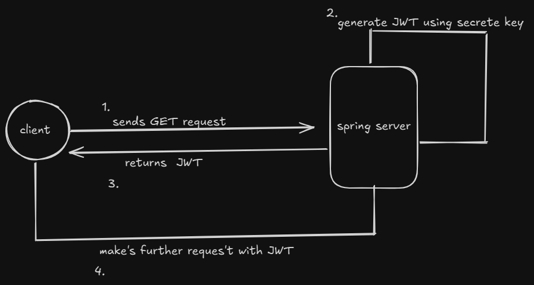

# JWT Authentication with Spring Boot

## Overview

This project is a Spring Boot-based authentication system using JSON Web Tokens (JWT). It provides secure user authentication and role-based authorization for different endpoints.

## Features

- User registration with password encryption
- Authentication using JWT
- Role-based access control (Admin/User)
- Secure API endpoints with Spring Security
- Stateless authentication using JWT filters

## Technologies Used

- Java 21
- Spring Boot 3.4.4
- Spring Security
- JSON Web Tokens (JWT)
- Hibernate & JPA
- MySQL Database
- Gradle

## Architecture Diagram

Below is the architecture diagram of the JWT-based authentication flow used in this project:



## Understanding Secrete Key 

You can refer to the following StackOverflow thread:

[Understanding JWT on StackOverflow](https://stackoverflow.com/questions/31309759/what-is-secret-key-for-jwt-based-authentication-and-how-to-generate-it)

## API Endpoints

| Endpoint         | Method | Access     | Description                      |
| ---------------- | ------ | ---------- | -------------------------------- |
| `/register/user` | POST   | Public     | Registers a new user             |
| `/authenticate`  | POST   | Public     | Authenticates user & returns JWT |
| `/home`          | GET    | Public     | General welcome endpoint         |
| `/admin/home`    | GET    | Admin only | Admin-specific content           |
| `/user/home`     | GET    | User only  | User-specific content            |

### Example Authentication Request

#### Request:

```json
POST /authenticate
{
  "username": "testuser",
  "password": "password123"
}
```

#### Response:

```json
{
  "token": "your_generated_jwt_token"
}
```

## Security & JWT Handling

- JWT tokens are generated using a secret key.
- Token validation ensures users can access protected resources.
- Passwords are securely stored using BCrypt hashing.